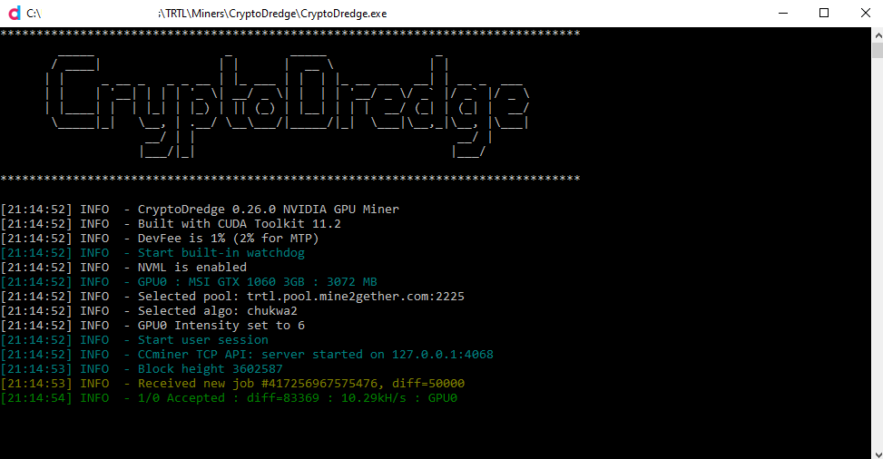

## Downloading and Installing for Windows or Linux

CryptoDredge can be downloaded from the [GitHub page](https://github.com/technobyl/CryptoDredge/releases)

## CryptoDredge Setup and Configuration

1. Unzip the file and extract the files into a new folder (Make sure your anti-virus doesn't delete the files)
2. Open the `config.json` file with Notepad
3. Find and change the following lines:

* `"url: "[pool address]"`
* `"user: "[wallet address]"`

- Instead of `[wallet address]`, simply paste your TurtleCoin wallet's address. Make sure to keep the quotes `"`!
  - If you don't have one yet, you can find out how to create a wallet [here](../wallets/Making-a-Wallet)

- In place of `[pool address]`, you'll need to choose a pool to mine towards. You can learn more about them [here](Pools). Again make sure to keep the quotes `"`!

4.  Save the file and
  * start `CryptoDredge.exe` for Windows
  *  or `./CryptoDredge` for Linux

That's it! You should be mining away now! :)

