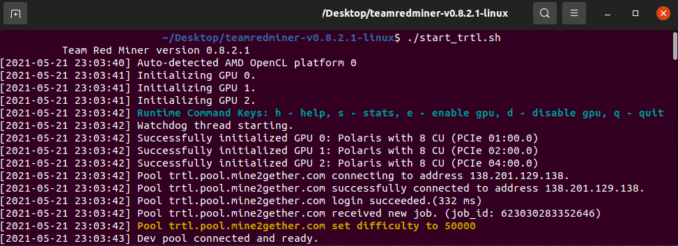

## Downloading and Installing for Windows or Linux

Teamredminer can be downloaded from the [GitHub page.](https://github.com/todxx/teamredminer/releases)

## Teamredminer Setup and Configuration

1. Unzip the file and extract the files into a new folder (Make sure your anti-virus doesn't delete the files)
2. Edit the batch file named "start_trtl_chukwa.bat".
3. Find and change the following lines:

* `-o stratum+tcp://turtlecoin.....` keep the `-o` but replace the address with a pool of your choice. You can learn more about them [here](Pools).
* `-u TRTL......` keep the `-u` but replace the one in the file with your own TurtleCoin address.

4.  Save the file and
  * start `start_trtl_chukwa.bat` for Windows
  *  or `./start_trtl_chukwa` for Linux

That's it! You should be mining away now! :)

## Troubleshooting
Most issues are usually because of out-of-date GPU drivers, if the miner doesnt work or cannot detect your GPU, try updating to the latest drivers!

